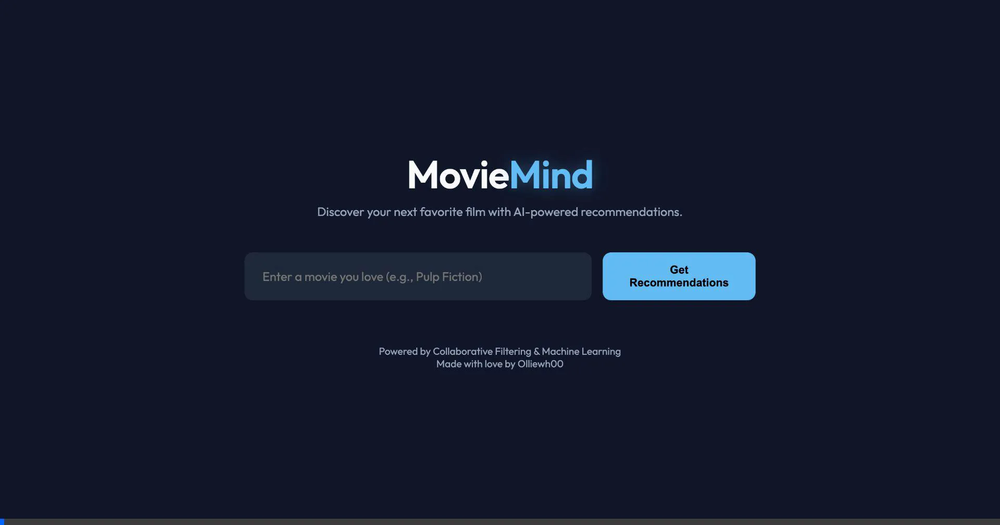
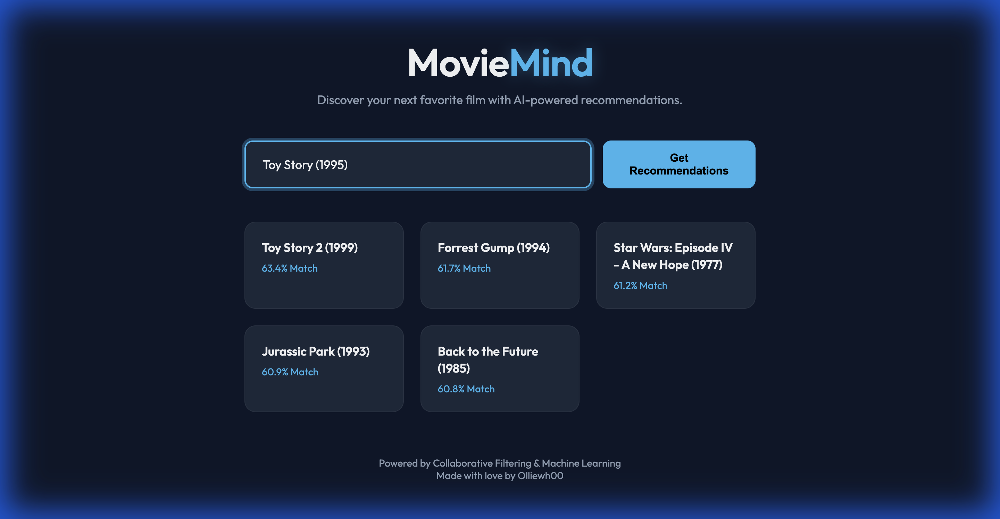

# 🎬 MovieMind - AI Movie Recommendation System

**MovieMind** is a powerful, AI-driven movie recommendation engine that suggests films based on user ratings. Built with Python, Flask, and Scikit-Learn, it uses **Collaborative Filtering (KNN)** to find movies similar to the ones you love.


*(Replace with a screenshot of your actual UI if you have one)*

## ✨ Features
- **🤖 AI-Powered Recommendations**: Uses K-Nearest Neighbors (KNN) to find mathematically similar movies based on millions of user ratings.
- **⚡ Instant Search**: Real-time autocomplete to find movies quickly.
- **🎨 Modern UI**: Sleek, dark-themed interface with glassmorphism effects.
- **🚀 Fast Performance**: Optimized with sparse matrices to handle large datasets efficiently.

## 🎥 Demo
Check out the app in action!

### Video Demo


### Recommendation Results


## 🛠️ Tech Stack
- **Backend**: Python, Flask
- **Machine Learning**: Scikit-Learn, Pandas, Scipy (Sparse Matrices)
- **Frontend**: HTML5, CSS3, JavaScript (Vanilla)
- **Dataset**: MovieLens 32M Dataset

## 🚀 How to Run Locally

### Prerequisites
- Python 3.8+
- `pip` (Python Package Manager)

### Installation

1.  **Clone the repository**
    ```bash
    git clone https://github.com/yourusername/movie-recommendation.git
    cd movie-recommendation
    ```

2.  **Install Dependencies**
    ```bash
    pip install flask pandas scipy scikit-learn
    ```

3.  **Download the Dataset**
    - Download the [MovieLens 32M Dataset](https://grouplens.org/datasets/movielens/32m/).
    - Extract it into a folder named `ml-32m` in the project root.
    - Ensure you have `movies.csv` and `ratings.csv` inside `ml-32m/`.

4.  **Run the App**
    ```bash
    python app.py
    ```

5.  **Open in Browser**
    - Go to `http://127.0.0.1:5000`
    - Type a movie name (e.g., "Inception") and hit Enter!

## 🧠 How It Works
1.  **Data Loading**: The app loads millions of ratings from the MovieLens dataset.
2.  **Filtering**: It filters out inactive users and obscure movies to ensure high-quality data.
3.  **Matrix Creation**: It constructs a **Sparse Matrix** (User-Item Matrix) where rows are movies and columns are users.
4.  **Model Training**: A **K-Nearest Neighbors (KNN)** model calculates the cosine similarity between movie vectors.
5.  **Recommendation**: When you search for a movie, the model finds the 5 nearest neighbors in the vector space.

## 📂 Project Structure
```
movie-recommendation/
├── app.py                 # Flask Server
├── recommender.py         # ML Logic & Data Processing
├── build_static_data.py   # Script to pre-calculate data (optional)
├── templates/
│   └── index.html         # Frontend HTML
├── static/
│   ├── style.css          # Styling
│   ├── script.js          # Frontend Logic
│   └── data.json          # Pre-calculated data (if using static mode)
└── ml-32m/                # Dataset (Not included in repo)
```

## 🤝 Contributing
Contributions are welcome! Feel free to open an issue or submit a pull request.

## 📜 License
This project is open-source and available under the [MIT License](LICENSE).

---
*Made with ❤️ by [Olliewh00](https://github.com/olliewh00)*